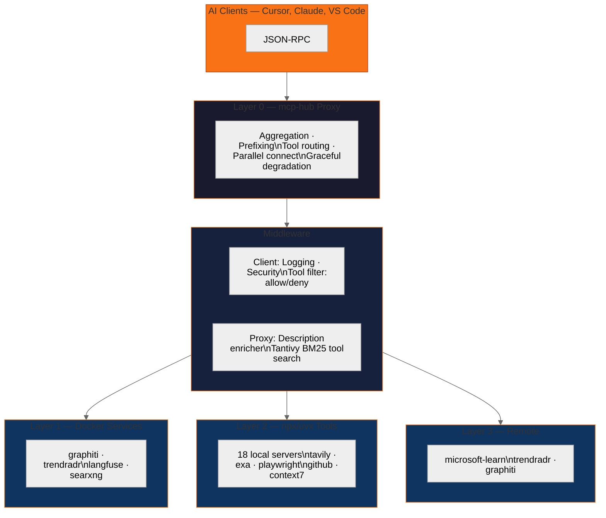

# mcp-hub

[](https://www.rust-lang.org/)
[](LICENSE)
[](https://github.com/Im-Busy/mcp-hub)


> Unified MCP management platform — proxy, package manager, inspector, and memory

## Why mcp-hub?

AI coding agents connect to MCP servers one-by-one — each with its own transport, config, and process. mcp-hub is **Layer 0** — a single endpoint that aggregates all MCP servers (Docker, npx/uvx, remote) behind one proxy. It combines patterns from 16 researched MCP repos into a polyglot architecture: Rust core + TypeScript Web UI + PowerShell orchestration.


## Architecture



| Layer | Capabilities | Status |
|-------|-------------|:-----:|
| **Proxy Core** | Tool aggregation, server-name prefixing, tool routing, parallel connect, graceful degradation | ✅ |
| **Middleware** | Logging, security filtering, tool allow/deny, description enrichment, Tantivy BM25 search | ✅ |
| **Transports** | STDIO, HTTP Streamable, Named Pipe | ✅ |
| **Security** | AES-256-GCM encryption, lazy auth, rate limiting | 🟡 |
| **Package Mgmt** | MCPBX manifest, install/publish from registry | 🟡 |
| **Web UI** | Interactive inspector, server dashboard, config GUI | 🔜 |


## Quick Start

```bash
# Auto-install
curl -fsSL https://raw.githubusercontent.com/Im-Busy/mcp-hub/main/install.sh | sh

# Run proxy
mcp-hub serve --config mcp-hub.example.json
npx mcp-hub serve --config mcp-hub.example.json

# Validate config
mcp-hub validate --config mcp-hub.example.json

# Check connected servers
mcp-hub status --config mcp-hub.example.json
```

| Platform | Install |
|----------|---------|
| **Cargo** | `cargo install mcp-hub` |
| **npx** | `npx mcp-hub serve` |
| **pip/uvx** | `uvx mcp-hub serve` |
| **Homebrew** | `brew install mcp-hub` |
| **Binary** | [GitHub Releases](https://github.com/Im-Busy/mcp-hub/releases) |

## Tech Stack

**Rust** · rmcp 1.7 · Axum 0.8 · Tokio · Tantivy 0.22 · Clap 4.5 · tracing · AES-256-GCM · zeroize

## License

Apache-2.0
